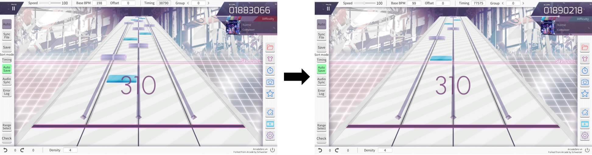

# Arcaea_AFF_SpeedChanger
> An Arcaea chart file modified program base on Python
# 功能
將 Arcaea譜面文件(.aff)做變速處理

# 安裝
直接下載原碼使用
# 使用方法
## 變速完整譜面資料夾

執行 run.py

*範例*
```bash
python run.py 0.9 C:\Users\Users\Downloads\infinitestrife
```
將會輸出至C:\Users\Users\Downloads\infinitestrife_0.9

## 單獨功能使用命令行

譜面變速  
arc_aff_modify_speed.py 輸入路徑 輸出路徑 變速倍率(0.5~2)數字越小越慢

*範例*
```bash
python arc_aff_modify_speed.py ./2.aff ./3.aff 0.9
```
音源變速  
change_audio.py 音源路徑 變速倍率(0.5~2)數字越小越慢

*範例*
```bash
python change_audio.py ./base.ogg 0.9
```

# 測試
執行run_test即可

# 待完成功能
- ~~對scenecontrol和camera變速支持~~
- ~~資料夾批量處理0~3.aff~~
- ~~音源變速~~
- songlist修改(改變基礎流速)